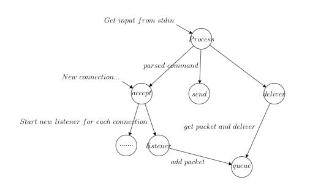

# Total-order and Causal-order Multicast
In this project, unicast, causal order multicast and total order multicast process. 

Group: _Chuchao Luo(chuchao2), Wenhan Zhao(wenhanz3)_   

(check README.md for better format)

## Basic schema
- Each process is a java process

- Each process has one thread to handle user Input, one thread to send message,
 one thread for deliver packet and one thread for each peer to retrieve packets.

- There is a master node to handle total order multicast.

- Each process maintains an internal vector clock


## Requirement
- MacOs or Linux (gnome desktop preferred)

- Java 9 installed

- Gradle installed

## Project structure
```
.
├── BlockingProcess.java                # Unicast process
├── CausalMulticastDemo.java            # Causal order multicast startup
├── CausalOrderProcess.java             # Causal order multicast processs 
├── Config.java                         # Configuration file parser
├── DelayParser.java                    # Delay parser for causal order "dealy command"
├── DeliverThread.java                  # The thread for deliver
├── Master.java                         # Master process for total order multicast
├── MasterUp.java                       # Master process startup
├── Message.java                        # Message object for total order multicast
├── Packet.java                         # Packet object for causal order multicast
├── TotalOrderDemo.java                 # "Ordinary" total order multicast startup
├── TotalOrderProcess.java              # "Ordinary" total order multicast process
├── UnicastDemo.java                    # Unicast startup
└── VectorClock.java                    # Vecterclock object
```

## Overview of a process

When a process start up, the foreground thread will start 3 background threads,
- send thread: get user input as 

- deliver thread: Pull the packet from `deliverQueue` and check if the packet is
OK to deliver. If so, this thread print the message. Otherwise it buffers the 
packet for later delivery.

- accept thread: keep listening on port assigned to this process. If a new
connection coming in, this thread makes a socket, wraps it as `ObjectOutputStream`
and put it in a map: `processID -> ObjectOutputStream`. It also starts a listener thread 
for each incoming connection.

- listener thread: keep reading packet from `ObjectInputStream`. Once it receives
a packet, it push the packet in `deliverQueue`.

## Algorithms and implementation
### Total Order Multicast:
For the total order multicast, we used a sequencer to receive all the message from each process.
First we use MasterUp to launch the sequencer and let it start listening on other processes. Then
four other processes up. 
When a process get a msend command, it starts total order multicast in the
following procedure : First the process send a message to the sequencer, and then put in the queue of
the sequencer, when the queue polls out this message, the sequencer gives the message a header indicating
how many messages have been sent by the sequencer including this one. Then the message was sent to every 
process. In each process, there is a cursor indicating message with which header should be delivered next,
if the incoming message's header is greater than the cursor in this process, we put it in a priorityqueue 
for buffer, otherwise we deliver it directly and update the cursor. Once we update the cursor, we check if
there are some messages in the priority queue that can be delivered, if so we poll from the queue and 
deliver message. This procedure ensures the same deliver order in every process. 

### Casual Order Multicast:
Each process maintains a vector clock. Sending packet and delivering packet leads to update of vector clock.

- Send a packet from process `i` result in `process.clock[i]++`

- Deliver a packet if and only if there exists a packet in buffer that 
`packet.clock[i] == process.clock[i]+1 && packet.clock[k] <= process.clock[k]
where k!=i and i < total process number`. After the delivery, update the process clock 
by `process.clock[i] = packet.clock[i]`.


## Build
```bash
gradle jar #(at root dir)
```

## Run
- Run CausalMulticastDemo by .jar after build
```bash
java -cp build/libs/CS425MP1.jar Process.CausalMulticastDemo <id> CausalConfiguration [script]
```

- Run TotalOrderDemo by .jar after build
```bash
java -cp build/libs/CS425MP1.jar Process.TotalOrderDemo <id> TotalConfiguration [script]
```

- Run UnicastDemo by .jar after build
```bash
java -cp build/libs/CS425MP1.jar Process.UnicastDemo <id> UnicastConfiguration [script]
```

- Startup 4 Unicast processes
```bash
./UnicastRun.sh 4 
#the number of process, has to be consistent to configuration file
```

- Startup 4 Total order multicast processes
```bash
./TotalMulticastRun.sh 4 [script directory name] 
#the number of process, has to be consistent to configuration file
#read startup command from script directory
```

- Startup 4 Causal order multicast processes
```bash
./CausalMulticastRun.sh 4 [script directory name] 
#the number of process, has to be consistent to configuration file
#read startup command from script directory
```

## Available command

### Unicast
```
send <id: int> <message>
```

### Total multicast
```
msend <message> [delay]
(The delay parameter is optional, if you want to customize the delay you can add
the delay, otherwise there will be a randomized delay within the range specified
in the configuration file) 
```

### Causal multicast

```
sleep (sleep for 1000ms)

clock (check current vector clock)

msend <message> [delay id=delay,id=delay...]
(the last delay will be used to other unspecified processes, current thread is always 0 (I think that make sense)
If not specified delay explicitly, random delay will be used)
```

### Exit
Just press Ctrl+C

## Script format

Same as available command
